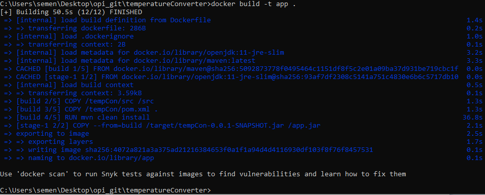
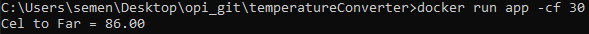
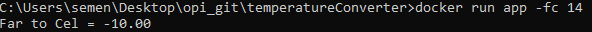
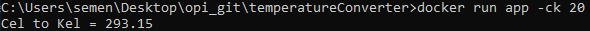

# temperatureConverter
Convert temperature between Kelvin, Fahrengeit and Celsius

# Start
Clone repository
> git clone https://github.com/SemenV/temperatureConverter.git

Cd working dir 
> cd temperatureConverter

Build image 
> docker build -t app .

Run application
> docker run app (-cf | -fc | -fk | -ck | -kx | -kf) number

